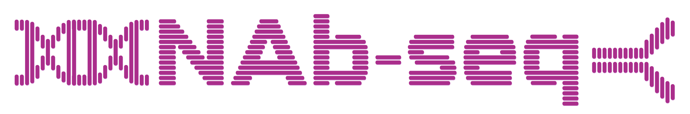

---
params:
  report_title:
  version:
  sample_sheet:
  annotation_table:
  nanocomp_pngs:
  nanocomp_txt:
  report_number:
  css_file:
title: "`r params$report_title`"
date: "`r Sys.Date()`"
output: 
  html_document:
    toc: true
    toc_float: true
    toc_collapsed: true
---

```{r setup, include=FALSE}
knitr::opts_chunk$set(echo = FALSE, error = FALSE, 
                      warning = FALSE, message = FALSE)
css_file <- paste0(params$css_file)
```

```{css, code=xfun::read_utf8(css_file), echo=FALSE}
``` 

<br /><br />

```{r} 
 
```

<br /><br />

## Introduction
Thank you for running `NAb-seq`, a Nextflow pipeline for analysing Oxford Nanopore sequencing data from hybridomas and single B cells! 
 
For more information about the pipeline, check out our [paper](https://www.tandfonline.com/doi/full/10.1080/19420862.2022.210662) or [website](https://kzeglinski.github.io/nab-seq/NAb_seq_vignette.html) (which contains a detailed bioinformatics tutorial).
<br /><br />

## Sample/run information
You have run version `r params$version` of `NAb-seq` on the following samples:

```{r}
sample_sheet <- read.delim(file = params$sample_sheet, sep = ",", 
                           header = TRUE)
sample_sheet <- sample_sheet[sample_sheet[, 4] == params$report_number , -4]
knitr::kable(
  sample_sheet,
  col.names = c('Barcode', 'Sample Name', 'Organism'),
  row.names=FALSE
)
```
<br /><br />

## Quality control
This is a selection of the most relevant QC plots and summary statistics 
produced by [NanoComp](https://github.com/wdecoster/NanoComp). A full QC
report is available in the results folder.

```{r}
nanocomp_summary <- readLines(con = params$nanocomp_txt, n = 9)
nanocomp_summary <- stringr::str_replace_all(nanocomp_summary, "[ ]{2,}", "\t")
nanocomp_summary <- stringr::str_split(nanocomp_summary, "\t", simplify = TRUE)
nanocomp_summary <- as.data.frame(nanocomp_summary)
colnames(nanocomp_summary) <- str_replace_all(nanocomp_summary[1, ], ".f.*$", "")
nanocomp_summary <- nanocomp_summary[-1, ]
sample_names <- str_replace_all(nanocomp_summary[1, ], ".f.*$", "")

knitr::kable(
  nanocomp_summary,
  col.names = sample_names,
  row.names=FALSE
)
```
<br /><br />

### Read number
```{r} 
read_number_file <- str_subset(unlist(str_split(params$nanocomp_pngs, " ")), "number_of_reads.png")
knitr::include_graphics(read_number_file) 
```

<details>
  <summary>How do I interpret this result?</summary>
  <p>Best results are usually achieved with at least 40,000 reads per barcode. 
Below this it is often possible to generate high-accuracy consensus sequences, 
but not guaranteed.</p>
</details> 

<br /><br />

### Read length
```{r} 
lengths_violin_file <- str_subset(unlist(str_split(params$nanocomp_pngs, " ")), "lengths_violin.png")
knitr::include_graphics(lengths_violin_file) 
```

```{r} 
overlay_histogram_file <- str_subset(unlist(str_split(params$nanocomp_pngs, " ")), "OverlayHistogram.png")
knitr::include_graphics(overlay_histogram_file) 
```

<details><summary>How do I interpret this result?</summary>

Although longer reads are more likely to recover full-length antibody sequences,
`NAb-seq` will always use the longest reads to make consensus sequences. Thus,
good results can be achieved even when most reads are <1 kb.

</details>  
<br /><br />

### Read quality
```{r} 
read_quality_file <- str_subset(unlist(str_split(params$nanocomp_pngs, " ")), "quals_violin.png")
knitr::include_graphics(read_quality_file) 
```

<details><summary>How do I interpret this result?</summary>

It is recommended that the reads used to run `NAb-seq` are basecalled with the
super high accuracy model, which has a Q score cutoff of 10 (~90% accuracy). If
you have a lot of reads below this cutoff, the consensus sequences may still 
contain some errors (usually indels in homopolymer regions).

</details>  
<br /><br />

## Consensus sequences
The below tables show some information about the **productive** heavy and light
chain sequences `NAb-seq` has identified in each cell. 
<br /><br />

<details><summary>How do I interpret these results?</summary>

Generally, there will be a light and heavy chain that are significantly more abundant than any others. 
These can be considered the representative heavy and light chain sequences for the cell. Other sequences
may result from sequencing or PCR errors, PCR chimeras between different antibody transcripts and leaky
transcription from the second allele. It is also not uncommon for hybridomas to express multiple productive
heavy and light chains per cell (see [this paper](https://pubmed.ncbi.nlm.nih.gov/29485921/)).

If you don't see a heavy or light chain sequence for your cell, it is likely that your sequencing 
coverage was insuficient to generate a productive consensus sequence or that you didn't basecall
in super-high accuracy mode.

</details>  
<br /><br />

```{r, results = 'asis'}
samples <- sample_sheet[, 2]
for (i in seq_along(samples)) {
  this_sample <- samples[i]
  cat("  \n###", as.character(unname(this_sample)), " \n")
  cat("Annotation of productive sequences only:")
  this_sample_file <- paste0(this_sample, "_productive_only_consensus_annotation.tsv")
  this_sample_data <- read.delim(this_sample_file, sep = "\t", header = TRUE)
  this_sample_data <- this_sample_data[order(-this_sample_data$count),]
  cat(print(knitr::kable(
  this_sample_data, row.names=FALSE
  )))
  cat("  \n <br /><br /> \n")
}
```